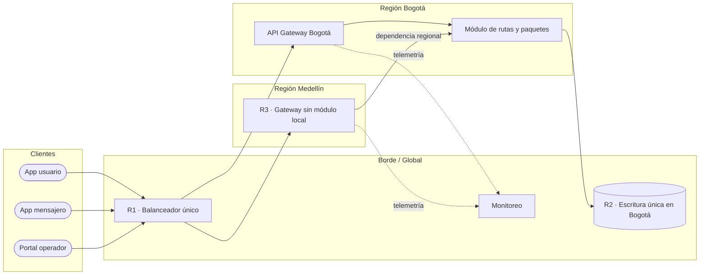

# Registro de trabajo en clase — Taller 4

## Fecha de la sesión

No especificada en los archivos fuente del repositorio.

## Integrantes presentes

- No especificados en los archivos fuente del repositorio.

## Objetivo de la sesión

Aplicar la metodología de cinco pasos al caso RedExpress para construir un mapa de infraestructura que permita diagnosticar, con evidencia visual, riesgos de disponibilidad, rendimiento y escalabilidad.

## Actividades realizadas

1. Se inventariaron los clientes, servicios de borde, componentes regionales, almacenamiento y monitoreo descritos en el caso.
2. Los elementos se agruparon en cuatro zonas: Clientes, Borde/Global, Región Bogotá y Región Medellín.
3. Se trazó el tráfico desde las aplicaciones hasta el balanceador, los API Gateway, el módulo de rutas y la base de datos.
4. Se marcaron explícitamente la redundancia y las dependencias regionales.
5. Se clasificaron y priorizaron los riesgos que se desprenden del mapa.

La herramienta seleccionada fue diagrams.net/draw.io porque permite conservar un entregable editable y versionable en Git. El mapa se guardó sin compresión XML para facilitar su revisión en el repositorio.

## Inventario y decisiones de modelado

| Zona | Componentes | Decisión de modelado |
|---|---|---|
| Clientes | App móvil de usuario, app móvil de mensajero, portal web de operador | Se modelan como puntos de entrada externos. |
| Borde / Global | Balanceador, monitoreo y base de datos | Se agrupan por prestar servicio a ambas regiones. |
| Región Bogotá | API Gateway y módulo de rutas/paquetes | Bogotá concentra el procesamiento de rutas. |
| Región Medellín | API Gateway | Se evidencia que no existe un módulo de rutas local. |

Las conexiones punteadas representan telemetría; las continuas, tráfico funcional. Los componentes en rojo y con identificador `R#` son hallazgos que aparecen también en la tabla de diagnóstico.

## Boceto inicial del modelo

El archivo editable está en [`mapa-borrador.drawio`](mapa-borrador.drawio).

## Diagnóstico priorizado del caso base

| ID | Componente exacto del mapa | Hallazgo | Categoría | Impacto | Prioridad |
|---|---|---|---|---|---|
| R1 | Balanceador de carga | Una sola instancia concentra todo el ingreso. | Disponibilidad | Una falla vuelve inaccesible toda la plataforma. | Alta |
| R2 | Base de datos distribuida | La escritura se concentra en Bogotá. | Rendimiento | Aumenta la latencia de rastreo para otras regiones y puede saturar el escritor. | Alta |
| R3 | API Gateway Medellín | Depende del módulo de rutas de Bogotá. | Escalabilidad | El crecimiento de Medellín consume la capacidad de Bogotá y amplía el dominio de falla. | Media |

## Retroalimentación incorporada

No se suministró retroalimentación docente en el repositorio. Como control interno, se aplicó la checklist de la guía: todos los componentes están agrupados, los flujos tienen dirección, la instancia única y la dependencia regional están marcadas, y cada riesgo de la tabla se puede localizar por su identificador en el mapa.

## Tareas de cierre

| Tarea | Responsable | Estado |
|---|---|---|
| Completar el mapa editable del caso RedExpress | Equipo responsable | Completada |
| Elaborar la propuesta de mejora | Equipo responsable | Completada |
| Redactar diagnóstico e investigación interna | Equipo responsable | Completada |
| Validar el mapa contra la checklist del repositorio | Equipo responsable | Completada |

## Autoevaluación

- [x] Componentes relevantes representados.
- [x] Agrupación por zona o capa.
- [x] Conexiones relevantes trazadas y dirigidas.
- [x] Redundancia y dependencias críticas marcadas.
- [x] Riesgos clasificados y priorizados.
- [x] Trazabilidad directa entre mapa y diagnóstico.

---

Este documento registra la aplicación en clase del Taller 4 de AREM — Universidad de La Sabana.
