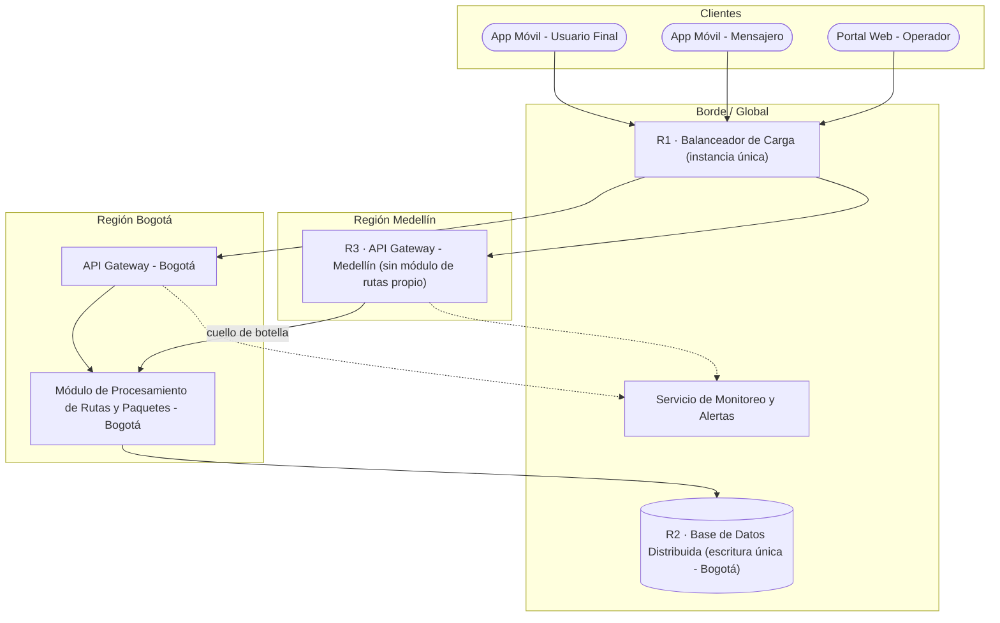
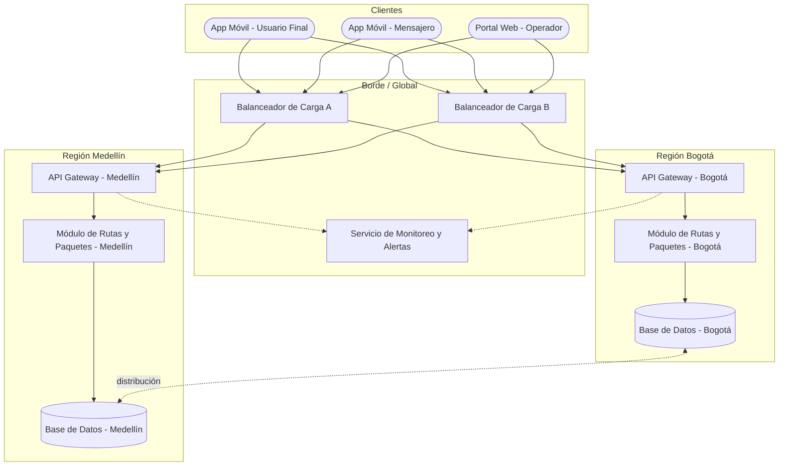

# Informe técnico del Taller 4

## Identificación

- **Taller:** Taller 4 — Mapa de Infraestructura y Diagnóstico Técnico.
- **Sistema analizado:** RedExpress, plataforma de logística descrita en el repositorio.
- **Integrantes:** no especificados en los archivos fuente del repositorio.
- **Modelo editable:** [`mapa-final.drawio`](mapa-final.drawio).
- **Trabajo de clase:** [`../clase/mapa-borrador.drawio`](../clase/mapa-borrador.drawio) y [`../clase/notas.md`](../clase/notas.md).

## 1. Fuentes y límite del análisis

Este informe usa exclusivamente el contenido de los siguientes archivos del repositorio:

1. [`../README.md`](../README.md), que define el objetivo, el caso RedExpress, los componentes esperados, las áreas críticas y los entregables.
2. [`../clase/guia_paso_a_paso_infraestructura.md`](../clase/guia_paso_a_paso_infraestructura.md), que contiene la notación, la metodología, el mapa construido por pasos, el diagnóstico, los errores comunes y la checklist.
3. [`../clase/visualizacion-infraestructura.html`](../clase/visualizacion-infraestructura.html), que presenta la misma infraestructura y los tres riesgos en una vista interactiva.
4. Las plantillas de `plantillas/`, usadas únicamente para organizar la entrega.

No se incorporan otros clientes, dominios, tecnologías, proveedores, métricas, integrantes ni fechas. Cuando el informe presenta una mejora, esta se deriva directamente del riesgo descrito por el material del repositorio.

## 2. Descripción general

RedExpress gestiona paquetes y rastreo de envíos mediante una aplicación móvil y una plataforma web. Su infraestructura es híbrida e incluye servicios en la nube, servidores regionales, centros de distribución físicos y dispositivos móviles utilizados por mensajeros. El sistema debe conservar disponibilidad y rendimiento durante campañas promocionales o temporadas de alto volumen como Navidad.

El mapa del repositorio organiza la infraestructura en cuatro zonas:

- **Clientes:** app móvil del usuario, app móvil del mensajero y portal web del operador.
- **Borde / Global:** balanceador de carga, monitoreo y alertas, y base de datos distribuida.
- **Región Bogotá:** API Gateway y módulo de procesamiento de rutas y paquetes.
- **Región Medellín:** API Gateway sin módulo local de procesamiento de rutas.

## 3. Proceso de desarrollo

Se aplicaron los cinco pasos definidos en la guía:

1. **Identificar componentes:** se tomó el inventario que aparece en el caso y en el ejemplo guiado.
2. **Agrupar por zona:** se conservaron las cuatro zonas establecidas por la guía.
3. **Conectar componentes:** se reprodujo el tráfico desde los clientes hasta el balanceador, los gateways, el módulo de rutas, la base de datos y el monitoreo.
4. **Marcar redundancia y capacidad:** se señalaron el balanceador único, la escritura única en Bogotá y la dependencia de Medellín.
5. **Diagnosticar y priorizar:** se usaron las categorías y prioridades exactas de la tabla de diagnóstico del repositorio.

El archivo final contiene dos páginas: **Estado diagnosticado**, que representa la situación descrita, y **Propuesta de mejora**, que elimina los tres riesgos mediante redundancia y capacidad regional.

## 4. Mapa del estado diagnosticado

La primera página de [`mapa-final.drawio`](mapa-final.drawio) contiene esta vista en formato editable.

## 5. Inventario de componentes

| Componente | Tipo de elemento | Zona | Función descrita | Condición relevante |
|---|---|---|---|---|
| App móvil — usuario final | Cliente | Clientes | Consultar la operación y el rastreo de envíos. | Punto de entrada. |
| App móvil — mensajero | Cliente | Clientes | Consultar y actualizar el rastreo durante la operación. | Sensible a la latencia de rastreo. |
| Portal web — operador | Cliente | Clientes | Operar la plataforma desde la web. | Punto de entrada. |
| Balanceador de carga | Infraestructura | Borde / Global | Recibir y distribuir el tráfico hacia las regiones. | Instancia única. |
| API Gateway Bogotá | Servicio | Región Bogotá | Recibir tráfico destinado a Bogotá. | Accede al módulo regional. |
| API Gateway Medellín | Servicio | Región Medellín | Recibir tráfico destinado a Medellín. | No tiene módulo de rutas propio. |
| Módulo de rutas y paquetes | Servicio | Región Bogotá | Procesar rutas y estados de paquetes. | Atiende también la dependencia de Medellín. |
| Base de datos distribuida | Base de datos | Borde / Global | Almacenar la información de la plataforma. | Escritura única en Bogotá. |
| Monitoreo y alertas | Servicio | Borde / Global | Recibir información de los gateways regionales. | Servicio compartido. |

## 6. Diagnóstico técnico priorizado

| ID | Componente exacto del mapa | Riesgo diagnosticado | Categoría | Impacto si ocurre | Prioridad |
|---|---|---|---|---|---|
| R1 | Balanceador de carga (instancia única) | Punto único de falla. | Disponibilidad | Toda la plataforma queda inaccesible. | **Alta** |
| R2 | Base de datos distribuida (escritura única en Bogotá) | Cuello de botella de latencia. | Rendimiento | Lentitud en el rastreo en tiempo real para mensajeros fuera de Bogotá. | **Alta** |
| R3 | Región Medellín sin módulo de rutas propio | Límite de escalabilidad geográfica. | Escalabilidad | No se puede atender el crecimiento de demanda en Medellín sin saturar Bogotá. | **Media** |

### Relación directa entre mapa y diagnóstico

- `R1` aparece sobre el balanceador de carga y demuestra que todo el tráfico depende de una única instancia.
- `R2` aparece sobre la base de datos y demuestra que la escritura se concentra en Bogotá.
- `R3` aparece sobre el gateway de Medellín; su conexión hacia el módulo de Bogotá muestra la dependencia regional.

## 7. Propuesta de mejora

La propuesta conserva los mismos tipos de componentes del caso y modifica únicamente la redundancia y la distribución regional que originan los riesgos.

La segunda página de [`mapa-final.drawio`](mapa-final.drawio) contiene esta vista en formato editable.

## 8. Trazabilidad de las mejoras

| Riesgo original | Cambio propuesto | Resultado esperado según el diagnóstico |
|---|---|---|
| R1 — balanceador único | Incorporar dos balanceadores capaces de dirigir tráfico a ambas regiones. | La entrada deja de depender de una única instancia. |
| R2 — escritura única en Bogotá | Distribuir la base de datos entre Bogotá y Medellín, eliminando la concentración de escritura indicada en el mapa original. | Reducir la dependencia de Bogotá y la latencia regional señalada. |
| R3 — Medellín sin procesamiento propio | Incorporar un módulo de rutas y paquetes en Medellín. | Permitir que el crecimiento de Medellín no sature el módulo de Bogotá. |

El servicio de monitoreo y alertas continúa recibiendo información de ambos gateways, tal como lo muestra el caso original.

## 9. Comparación entre el estado y la propuesta

| Aspecto | Estado diagnosticado | Propuesta de mejora |
|---|---|---|
| Entrada de tráfico | Un balanceador de carga. | Dos balanceadores conectados con ambas regiones. |
| Procesamiento Bogotá | Gateway y módulo de rutas local. | Se conserva la capacidad regional. |
| Procesamiento Medellín | Gateway dependiente del módulo de Bogotá. | Gateway y módulo de rutas local. |
| Datos | Base distribuida con escritura única en Bogotá. | Capacidad de datos distribuida entre las dos regiones. |
| Monitoreo | Ambos gateways reportan al servicio de monitoreo. | Se conserva el monitoreo de ambas regiones. |
| Disponibilidad | Existe un punto único de falla en el borde. | El borde queda redundante. |
| Rendimiento | La escritura concentrada añade latencia fuera de Bogotá. | La capacidad regional evita esa concentración. |
| Escalabilidad | Medellín crece a costa de la capacidad de Bogotá. | Cada región dispone de su propio procesamiento. |

## 10. Investigación complementaria basada en el repositorio

### Infraestructura híbrida

El `README.md` caracteriza RedExpress como una infraestructura híbrida compuesta por nube, servidores regionales, centros de distribución físicos y dispositivos móviles. El mapa representa esa combinación separando clientes, componentes globales y regiones. Esta agrupación permite localizar qué recursos afectan a toda la plataforma y cuáles afectan a una región concreta.

### Redundancia y disponibilidad

La guía muestra que identificar un componente no es suficiente: también debe indicarse si tiene redundancia. El balanceador único se clasifica como punto único de falla porque su indisponibilidad bloquea el acceso total. La propuesta responde directamente con redundancia del mismo componente.

### Rendimiento y distribución de datos

El material distingue un cuello de botella de un punto único de falla. La escritura única en Bogotá no se describe como caída total, sino como origen de latencia para mensajeros fuera de esa región. La mejora consiste en eliminar la concentración regional de la escritura conservando el concepto de base de datos distribuida incluido en el caso.

### Escalabilidad geográfica

El gateway de Medellín depende del módulo de Bogotá. Por eso el problema se clasifica como escalabilidad: un aumento de demanda en Medellín también consume la capacidad de Bogotá. Añadir el módulo regional de Medellín elimina esa dependencia sin cambiar la estructura funcional descrita por el repositorio.

Las referencias internas completas están en [`referencias.md`](referencias.md).

## 11. Validación con la checklist del taller

- [x] Todos los componentes mencionados por el caso están representados.
- [x] Los componentes están agrupados en Clientes, Borde/Global, Bogotá y Medellín.
- [x] Las conexiones relevantes tienen dirección.
- [x] Los tres componentes críticos indican su condición de redundancia o dependencia.
- [x] Cada riesgo está clasificado como disponibilidad, rendimiento o escalabilidad.
- [x] Cada riesgo de la tabla tiene un identificador visible en el mapa.
- [x] La propuesta de mejora responde a los mismos tres hallazgos.
- [x] No se incorporó información de otros proyectos o clientes.

## 12. Limitaciones

El repositorio no aporta mediciones de latencia, volumen de tráfico, capacidad instalada ni resultados de pruebas. Por esa razón el informe conserva las prioridades cualitativas de la guía y no inventa cifras. Tampoco selecciona productos o proveedores concretos: la entrega se limita a los componentes y relaciones definidos para RedExpress.

## Conclusión

El mapa permite demostrar tres problemas concretos: un punto único de falla en el balanceador, un cuello de botella de escritura en Bogotá y una dependencia de escalabilidad entre Medellín y Bogotá. La propuesta final conserva la arquitectura regional del caso y corrige exactamente esos tres problemas mediante redundancia en el borde, distribución regional de datos y procesamiento de rutas en ambas regiones.

---

Este documento forma parte de la entrega del Taller 4 de AREM — Universidad de La Sabana.
