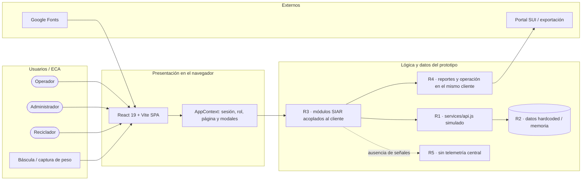
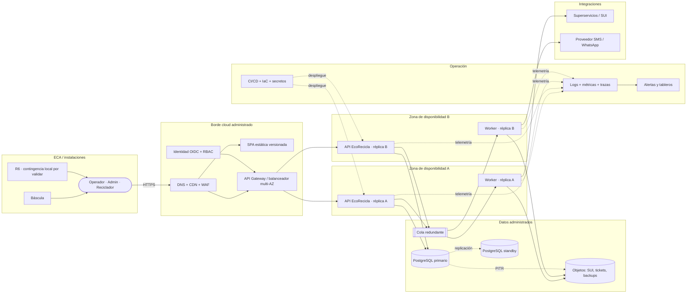

# Informe técnico del Taller 4

## Identificación

- **Taller:** Taller 4 — Mapa de Infraestructura y Diagnóstico Técnico.
- **Cliente analizado:** EcoRecicla, sistema SIAR para una Estación de Clasificación y Aprovechamiento (ECA).
- **Integrante:** Martin Ortega (`m4rtin24`).
- **Fecha:** 6 de septiembre de 2026.
- **Modelo editable:** [`mapa-final.drawio`](mapa-final.drawio).
- **Caso base:** [`../clase/mapa-borrador.drawio`](../clase/mapa-borrador.drawio) y [`../clase/notas.md`](../clase/notas.md).

## Resumen ejecutivo

EcoRecicla cubre procesos operativos y regulatorios sensibles: pesajes, recicladores, rutas, materiales, vehículos, balance de masas, reportes SUI y PQR. El levantamiento disponible describe un prototipo React/Vite con navegación y autenticación simuladas en el cliente, estado en memoria, funciones de API simuladas y datos codificados en la interfaz. El repositorio de este taller no contiene inventario de recursos cloud, configuración de red, infraestructura como código, backend productivo ni mediciones; por tanto, no hay evidencia para afirmar que exista una plataforma de producción redundante.

El diagnóstico identifica cinco brechas principales: ausencia de persistencia transaccional, inexistencia de una API productiva, concentración del procesamiento en el navegador, falta de aislamiento para tareas pesadas y ausencia de telemetría central. También se registra como supuesto por validar la dependencia operativa de cada ECA respecto a Internet y a la báscula. Las prioridades inmediatas son crear una fuente de verdad persistente, desacoplar frontend y backend, y diseñar recuperación y observabilidad antes de pensar en expansión multirregional.

La arquitectura objetivo propone una solución híbrida y neutral frente al proveedor: dispositivos y básculas permanecen en la ECA; en cloud, la SPA se distribuye por CDN, una API sin estado se replica en al menos dos zonas, los trabajos de reportes y notificaciones se ejecutan mediante cola, PostgreSQL opera con primario/standby y recuperación a un punto en el tiempo, y métricas, logs y trazas alimentan alertas. Este es un diseño propuesto, no un despliegue realizado.

## 1. Alcance, evidencia y límites

### Incluido

- Mapa lógico AS-IS del estado documentado.
- Mapa lógico/físico TO-BE propuesto, con zonas, redundancia y flujos.
- Diagnóstico de disponibilidad, rendimiento y escalabilidad.
- Priorización, controles y criterios de verificación.
- Comparación con el caso base RedExpress.
- Investigación de buenas prácticas y referencias oficiales.

### No incluido

- Creación de cuentas o recursos cloud.
- Elección contractual de proveedor o estimación de costos.
- Migración de datos, implementación de backend o pruebas de penetración.
- Certificación de RTO, RPO, disponibilidad o capacidad sin mediciones reales.

### Convenciones de evidencia

| Marca | Significado |
|---|---|
| **Documentado** | Característica suministrada en el contexto funcional del sistema. |
| **Inferido** | Consecuencia técnica razonable del estado documentado; debe comprobarse. |
| **Propuesto** | Elemento de la arquitectura objetivo; aún no implica implementación. |
| **Por validar** | Dato operativo que requiere confirmación del cliente o una medición. |

## 2. Metodología aplicada

1. **Identificación:** se inventariaron usuarios, interfaz, módulos funcionales, estado, capa de acceso a datos e integraciones previstas.
2. **Agrupación:** el AS-IS se separó en usuarios/ECA, presentación, lógica/datos y externos. El TO-BE se separó en ECA, borde, dos zonas de aplicación, datos, integraciones y operación.
3. **Conexión:** cada flecha indica un flujo real o propuesto; las líneas punteadas se reservan para telemetría, replicación o respaldos.
4. **Redundancia/capacidad:** cada componente crítico declara si es único, replicado o administrado; los puntos sin evidencia se marcan como riesgo.
5. **Diagnóstico:** los identificadores `R1` a `R6` enlazan componentes del mapa, tabla de riesgos y controles.

## 3. Estado actual documentado (AS-IS)

### Vista lógica

La vista editable correspondiente es la primera página, **AS-IS · EcoRecicla**, de [`mapa-final.drawio`](mapa-final.drawio).

### Inventario AS-IS

| Elemento | Tipo | Estado | Responsabilidad | Redundancia/capacidad conocida |
|---|---|---|---|---|
| Navegador de operador/administrador/reciclador | Dispositivo cliente | Documentado | Ejecutar la SPA y mantener estado de sesión. | Depende de cada dispositivo; sin continuidad central documentada. |
| Báscula o captura manual | Dispositivo ECA | Documentado a nivel funcional | Suministrar el peso de materiales. | Integración física y modo degradado por validar. |
| React 19 + Vite SPA | Aplicación web | Documentado | Presentación y navegación de los módulos SIAR. | Una unidad lógica de frontend; despliegue real no evidenciado. |
| AppContext | Componente de aplicación | Documentado | Autenticación simulada, rol, página y modales. | Estado volátil en el navegador. |
| Módulos SIAR | Componentes de aplicación | Documentado | Pesaje, recicladores, rutas, materiales, vehículos, balance, SUI y PQR. | Ejecutados en el cliente. |
| `services/api.js` | Servicio simulado | Documentado | Responder con datos ficticios. | No es un backend ni una frontera transaccional real. |
| Datos hardcoded/memoria | Almacenamiento simulado | Documentado | Alimentar vistas y formularios. | Sin persistencia, réplica, backup ni recuperación. |
| Google Fonts | Dependencia externa | Documentado | Tipografía de la interfaz. | La carga remota puede degradarse; no debe bloquear la operación. |
| Portal SUI / notificaciones | Integraciones | Parcialmente documentado | Salida regulatoria y comunicaciones. | Botones/exports sin integración productiva evidenciada. |

## 4. Diagnóstico técnico priorizado

La prioridad combina impacto y probabilidad cualitativos. Cuando no existen métricas, el hallazgo se denomina **riesgo potencial**, no incidente comprobado.

| ID | Componente del mapa | Hallazgo y evidencia | Categoría | Impacto | Prob. | Prioridad |
|---|---|---|---|---|---|---|
| R1 | `services/api.js` simulado | No existe una API productiva documentada que coordine validación, concurrencia, autorización y transacciones. | Disponibilidad | La operación compartida no puede sostenerse de forma confiable ni recuperarse como servicio. | Alta | **Alta** |
| R2 | Datos hardcoded / memoria del navegador | No existe una fuente persistente de verdad, réplica ni backup documentados. | Disponibilidad | Pérdida o inconsistencia de pesajes, balances, PQR y trazabilidad regulatoria. | Alta | **Alta** |
| R3 | SPA y lógica concentradas en el cliente | No hay capa de cómputo horizontal documentada; cada función crece dentro de la misma unidad lógica. | Escalabilidad | El crecimiento de estaciones, usuarios y reglas aumenta acoplamiento y dificulta escalar componentes por separado. | Alta | **Alta** |
| R4 | Pesajes y generación de reportes en el mismo camino | Riesgo potencial de que exportaciones SUI o cálculos agregados compitan con la interacción operativa. No hay pruebas de carga. | Rendimiento | Lentitud o bloqueo perceptible durante cierres y generación de archivos. | Media | **Media** |
| R5 | Plataforma completa | No hay telemetría central, alertas ni procedimiento de recuperación documentados. | Disponibilidad | Aumentan el tiempo de detección y el tiempo de recuperación; fallas silenciosas pueden afectar datos. | Alta | **Alta** |
| R6 | Enlace ECA–cloud y báscula | Dependencia física/Internet inferida; no se documenta modo offline, buffer local o captura contingente. | Disponibilidad | Una caída del enlace o periférico puede detener el registro de pesajes en la estación. | Media | **Media** |

### Orden recomendado de tratamiento

1. **R1 + R2:** backend transaccional y persistencia; sin esta base, los demás controles no protegen información real.
2. **R5:** observabilidad, backup restaurable y procedimientos de recuperación desde el primer ambiente productivo.
3. **R3:** servicios sin estado replicables y separación de responsabilidades.
4. **R4:** cola de trabajos y workers para reportes/notificaciones, guiados por mediciones.
5. **R6:** contingencia local o modo offline, después de validar operación, conectividad y básculas con cada ECA.

## 5. Arquitectura objetivo propuesta (TO-BE)

### Vista de infraestructura

La vista editable correspondiente es la segunda página, **TO-BE · EcoRecicla**, de [`mapa-final.drawio`](mapa-final.drawio).

### Decisiones de diseño

| Decisión | Justificación | Riesgos tratados |
|---|---|---|
| Separar SPA estática y API transaccional | Permite versionar/cachar la interfaz y controlar transacciones, validación y permisos en el servidor. | R1, R3 |
| Ejecutar al menos dos réplicas sin estado en zonas distintas | Evita depender de un único proceso o zona y habilita escalamiento horizontal. | R1, R3 |
| Usar PostgreSQL primario + standby con failover y PITR | Crea una fuente de verdad, reduce tiempo de recuperación y protege trazabilidad. | R2, R5 |
| Enviar SUI, consolidaciones y notificaciones a una cola | Aísla tareas largas, permite reintentos/idempotencia y protege la latencia de pesaje. | R4 |
| Instrumentar logs, métricas y trazas correlacionadas | Permite detectar errores y seguir un pesaje extremo a extremo. | R5 |
| Mantener artefactos SUI/tickets en objetos versionados | Facilita auditoría, reenvío y retención independiente de la base transaccional. | R2, R4 |
| Diseñar contingencia de ECA después de una prueba de campo | Evita inventar un modo offline incompatible con la báscula o las reglas de conciliación. | R6 |

### Redundancia y capacidad objetivo

| Componente crítico | Configuración mínima propuesta | Señal de capacidad/falla |
|---|---|---|
| CDN/WAF/balanceador | Servicio administrado multi-AZ. | Errores 4xx/5xx, latencia de borde, salud de targets. |
| API EcoRecicla | 2 réplicas mínimas, una por zona; escalamiento horizontal. | Solicitudes/s, CPU/memoria, p95/p99, tasa de error. |
| Workers | 2 réplicas; escalamiento por profundidad y edad de cola. | Mensajes pendientes, mensaje más antiguo, reintentos, cola muerta. |
| Cola | Servicio redundante; entrega al menos una vez e idempotencia en consumidor. | Mensajes visibles, DLQ, edad, tasa de consumo. |
| PostgreSQL | Primario + standby en otra zona; failover probado. | Conexiones, IOPS, bloqueos, lag, almacenamiento, error de failover. |
| Backups/objetos | Cifrado, versionado, retención y prueba periódica de restauración. | Último backup exitoso, edad del backup, restauración verificada. |
| Observabilidad | Colector y almacenamiento administrados con alertas fuera del dominio de la app. | Pérdida de señales, retraso de ingestión, alertas sintéticas. |

### Integridad y operación segura

- El backend debe validar rol y autorización; ocultar una opción en la interfaz no es un control de acceso.
- Cada pesaje debe tener identificador idempotente para evitar duplicados en reintentos.
- Cambios de precios, vehículos, balances y reportes deben producir auditoría inmutable con actor y fecha.
- Secretos y llaves no deben estar en el repositorio ni en el bundle del navegador.
- Las comunicaciones deben usar TLS; datos y backups, cifrado en reposo.
- La generación SUI debe conservar versión, hash, estado de envío y evidencia de respuesta.

## 6. Trazabilidad riesgo–control–prueba

| Riesgo | Control propuesto | Verificación de aceptación |
|---|---|---|
| R1 | API real, balanceador y réplicas sin estado. | Apagar una réplica durante una prueba y confirmar que un pesaje válido continúa sin error ni duplicado. |
| R2 | PostgreSQL HA, backups, PITR y auditoría. | Restaurar un backup en ambiente aislado y reconciliar conteos/totales contra el origen. |
| R3 | Escalamiento horizontal separado para API y workers. | Ejecutar prueba de carga y demostrar que nuevas réplicas reducen saturación sin romper sesiones. |
| R4 | Cola, workers e idempotencia. | Generar reportes concurrentes mientras se registran pesajes; verificar latencia y reintentos controlados. |
| R5 | Métricas, logs, trazas, SLO y alertas. | Provocar un error conocido y comprobar alerta, traza correlacionada y procedimiento de respuesta. |
| R6 | Protocolo contingente o buffer local, sujeto a validación. | Simular pérdida de Internet/báscula en una ECA y reconciliar los registros al recuperar el servicio. |

## 7. Objetivos operativos iniciales por validar

Estos valores son hipótesis de diseño para iniciar pruebas con el cliente; no describen niveles actuales ni compromisos contractuales.

| Indicador | Objetivo inicial | Método de medición |
|---|---|---|
| Disponibilidad de registro de pesaje | 99,9 % mensual | Solicitud sintética + tasa de éxito de transacciones. |
| Latencia de lectura API | p95 menor a 500 ms | Trazas en el gateway y API, sin incluir red del usuario. |
| Latencia de escritura de pesaje | p95 menor a 800 ms | Traza extremo a extremo hasta confirmación de commit. |
| Detección de fallo crítico | Menos de 5 minutos | Diferencia entre inicio del incidente y alerta. |
| RPO | Máximo 15 minutos | Prueba de recuperación y verificación del último punto restaurable. |
| RTO | Máximo 60 minutos | Simulacro desde declaración hasta servicio validado. |
| Cola en operación normal | Mensaje más antiguo menor a 2 minutos | Métrica de edad máxima, separada por tipo de trabajo. |

## 8. Diferencias frente al caso RedExpress

| Dimensión | RedExpress | EcoRecicla |
|---|---|---|
| Motor del negocio | Rastreo y logística de paquetes en varias ciudades. | Pesaje, aprovechamiento de materiales, operación de ECA y reporte regulatorio. |
| Riesgo geográfico principal | Medellín depende del procesamiento de rutas en Bogotá. | La expansión geográfica aún no está evidenciada; primero falta una plataforma productiva persistente. |
| Dato crítico | Estado y ubicación de paquetes. | Peso, material, reciclador, precio, balance de masas, PQR y evidencia SUI. |
| Operación física | Mensajeros, centros y servidores regionales. | Operador y báscula en la ECA; cloud para servicios compartidos. |
| Prioridad | Eliminar balanceador único y dependencia regional. | Crear API/base de datos reales, recuperación y observabilidad; luego escalar por zonas. |
| Tarea pesada | Procesamiento regional de rutas. | Consolidación, XML/exportación SUI y notificaciones. |

Ambos casos comparten la regla esencial del taller: el riesgo debe localizarse en un componente del mapa. La adaptación no copia la topología multirregional de RedExpress; toma su método y lo ajusta a la madurez y criticidad de EcoRecicla.

## 9. Investigación complementaria aplicada

Los principios de confiabilidad de AWS recomiendan recuperación automática, pruebas de recuperación, escalamiento horizontal y automatización de cambios [[1]](referencias.md#referencias). Se aplican proponiendo réplicas en dos zonas, failover probado y despliegues automatizables. La documentación de Kubernetes explica que el HPA ajusta réplicas con métricas de recursos o personalizadas [[2]](referencias.md#referencias); en este caso conviene combinar CPU con solicitudes por segundo para la API y edad/profundidad de cola para workers.

PostgreSQL documenta las alternativas de standby, failover y replicación, incluida la tensión entre consistencia y latencia [[3]](referencias.md#referencias). Esto sustenta el patrón primario/standby, pero no reemplaza una prueba con la carga real de pesajes. OpenTelemetry plantea logs, métricas y trazas como señales complementarias y recomienda SLI desde la perspectiva del usuario [[4]](referencias.md#referencias). Por ello se propone medir la transacción completa de pesaje y no solamente CPU o disponibilidad de procesos.

La síntesis y los enlaces completos están en [`referencias.md`](referencias.md).

## 10. Plan de implementación recomendado

### Fase 0 — Validación (antes de construir)

- Confirmar sedes, conectividad, modelos de báscula, volumen diario y ventanas pico.
- Inventariar datos personales/regulatorios, retención y responsables.
- Acordar los SLO, RTO y RPO propuestos.
- Seleccionar proveedor/región y revisar residencia de datos, costo y soporte.

### Fase 1 — Fundamento transaccional

- Implementar identidad, RBAC, API, esquema de base de datos y migraciones.
- Incorporar validación del lado servidor, idempotencia y auditoría.
- Desplegar un ambiente no productivo con backups desde el inicio.

### Fase 2 — Resiliencia y desacoplamiento

- Distribuir la SPA por CDN y publicar la API detrás de gateway/balanceador.
- Replicar API y workers en dos zonas.
- Habilitar standby, failover, PITR, cola y almacenamiento de objetos.

### Fase 3 — Evidencia operativa

- Instrumentar trazas, métricas, logs, tableros y alertas.
- Ejecutar carga, fallo de una réplica, failover de datos y restauración.
- Documentar runbooks y responsables de incidentes.

### Fase 4 — Continuidad de la ECA

- Probar conectividad y báscula en campo.
- Diseñar buffer/offline solo si la evidencia demuestra que es necesario.
- Definir conciliación, conflictos y controles antifraude antes de habilitar sincronización diferida.

## 11. Supuestos y preguntas abiertas

| Supuesto/pregunta | Estado | Acción requerida |
|---|---|---|
| Una región cloud colombiana o cercana satisface requisitos legales y de latencia. | Por validar | Revisión jurídica/técnica y prueba de latencia. |
| La báscula expone una interfaz integrable o existe captura manual controlada. | Por validar | Inventario de modelos y prueba en la ECA. |
| SUI admite el mecanismo de entrega representado. | Por validar | Confirmar especificación, credenciales, horarios y acuses. |
| SMS/WhatsApp es necesario para tickets/notificaciones. | Por validar | Definir consentimiento, proveedor, costo y retención. |
| Los módulos pueden compartir inicialmente un backend modular. | Propuesto | Revisar límites de dominio; evitar microservicios prematuros. |
| Un primario PostgreSQL cubre la carga inicial. | Propuesto | Medir TPS, tamaño, consultas y crecimiento; agregar réplicas/partición solo con evidencia. |

## 12. Autoevaluación contra la rúbrica

- [x] El caso base representa clientes, zonas, nodos, servicios y riesgos críticos.
- [x] El mapa final separa estado actual y objetivo, y declara redundancia.
- [x] Cada cuello de botella o punto de falla tiene ID, evidencia, impacto y prioridad.
- [x] La adaptación usa procesos propios de EcoRecicla y no copia la topología de RedExpress.
- [x] La investigación usa fuentes oficiales y cada práctica se relaciona con una decisión.
- [x] Los supuestos se distinguen de los hechos y tienen acción de validación.

## Conclusión

El mayor riesgo de EcoRecicla no es todavía una región saturada, sino intentar operar procesos regulados sobre un prototipo sin persistencia ni frontera transaccional productiva documentadas. La secuencia correcta es construir integridad y recuperabilidad, observar el comportamiento real y, después, escalar. El mapa TO-BE establece un camino verificable: cada control responde a un riesgo identificado y cada riesgo tiene una prueba de aceptación.

---

Este documento hace parte de la entrega del Taller 4 del curso AREM — Universidad de La Sabana.
